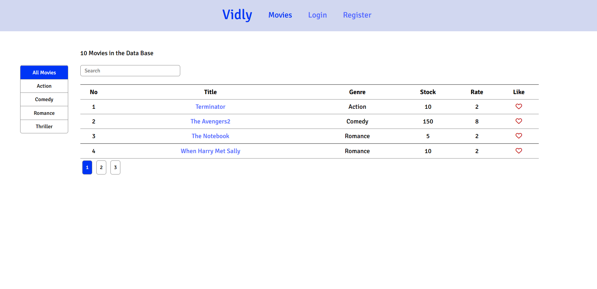
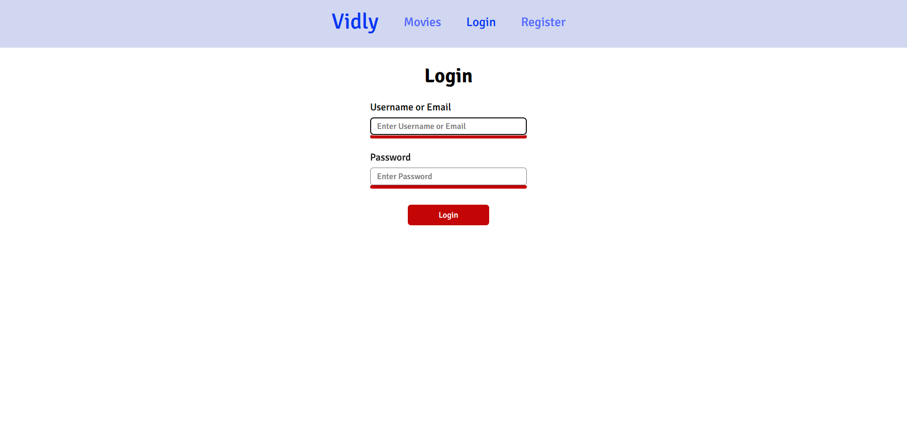
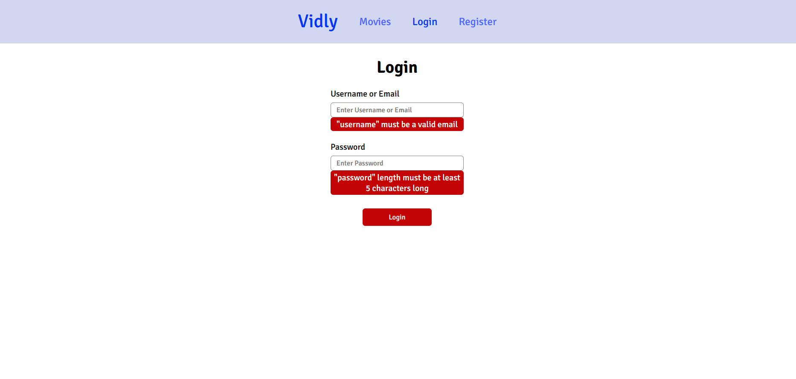
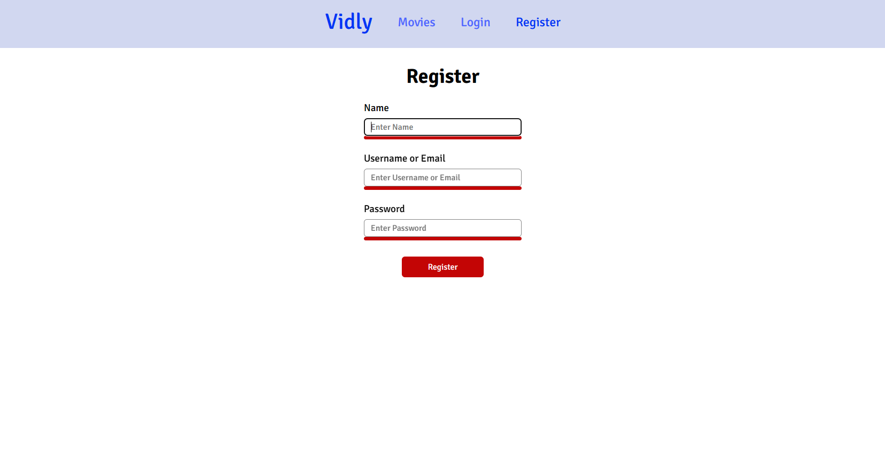
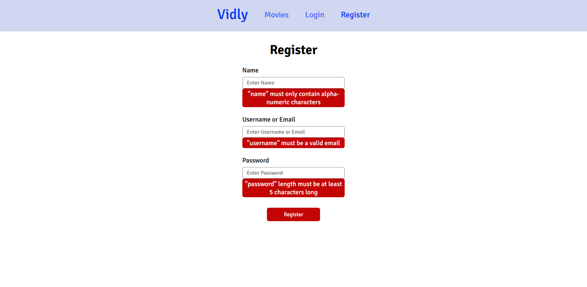
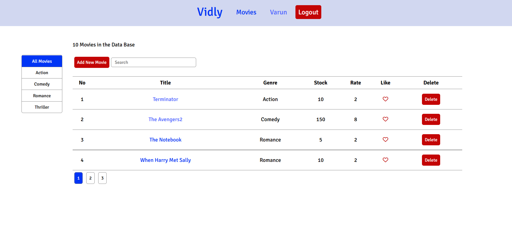
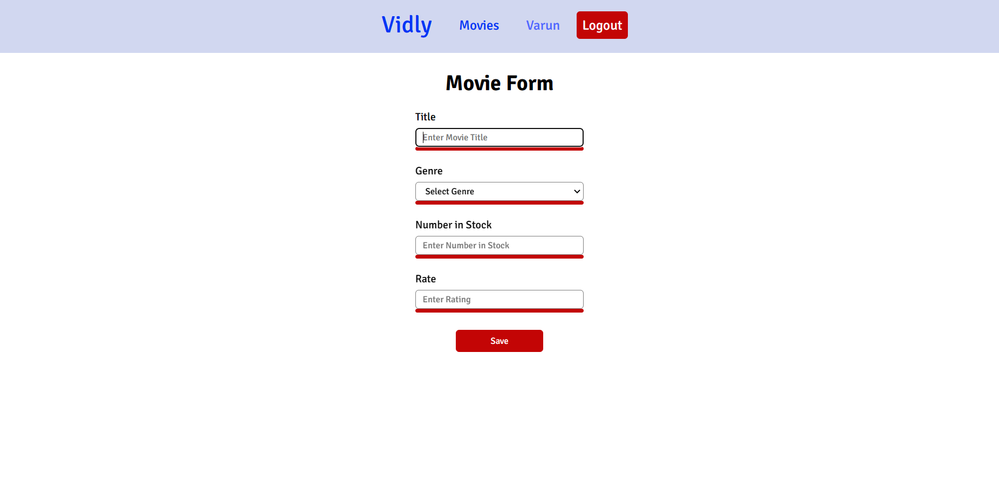
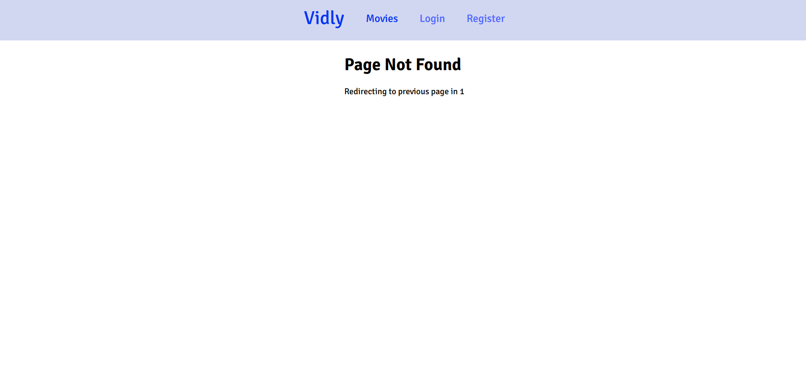

# Vidly Project

>This is a Frontend of a simple imaginary movie rentel application. To run this app first you have to set a MongoDB database and a Node.js Backend which can be found in my [Vidly-Backend](https://github.com/Varunvaru524/Vidly-Backend) repository

# Features

+ Pagination
+ Filtering
+ Sorting
+ Routing with React Router 6
+ Forms
+ Calling Backend Servies with Axios
+ Authentication and Authorization with Json Web Token

# Screenshots

### All Movies
 

### Login Page
  

### Login Page Validation

  

### Registration Page
 

### Registration Page Validation
 

### After Loggedin
 

### Movie Form
 

### Movie Form validation
 

### Not Found Page

# Technologies Used

+ React Router 6 - Routing
+ Axios - Backend Services
+ Proptypes - Validate props datatypes
+ Joi Browser - Form Validation
+ React Toastify - Popup Notification
+ Jwt Decode - Decode JSON Web Tokens

# Setup
After setting up the mongoDB database and the node.js backend as instructed in [Vidly-Backend](https://github.com/Varunvaru524/Vidly-Backend) repository

## Fork and Clone
Fork and clone this repository on your local machine with the command

    git clone https://github.com/Varunvaru524/Vidly-Frontend.git

## Install Dependencies
To install all the dependencies which is required to run the application

    npm i

## Start
To start the react app in your local machine

    npm start